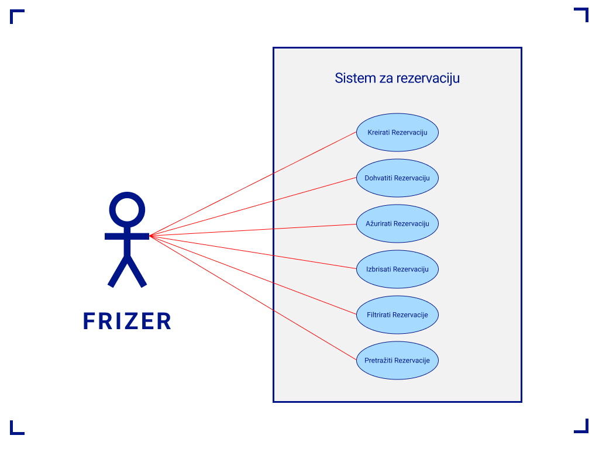

# Sustav za Frizerski Salon

Namjena ovog sustava je pomoći bilo kojem frizerskom salonu lakše pratiti svoje rezervacije, mušterije, radnike i usluge. 

## Use Case Diagram



## Funkcionalnosti

Sustav podržuje stvaranje, uređivanje, brisanje i pregledavanje usluga, frizera (radnika), mušterija i rezervacija. 
Podaci su vidljivi u tabličnom prikazu i mogu biti pregledani u individualnom prikazu.

### Vizualizacija

Sustav podržava prikaz 3 vizualizacije:

- Broj rezervacije po radniku
- Broj rezervacije po mjesecu
- Prihod po mjesecu


### Automatsko slanje elektronske pošte

Sustav podržava automatsko slanje pošte mušteriji sa detaljima njihove rezercije.
Služi kao potvrda te podsjetnik mušteriji o svojoj rezervaciji termina. **Za omogućavanje ove funkcionalnosti potrebne su dodatne postavke!**.

### Breadcrumbs

Na vrhu sustava se nalaze tako zvani "breadcrumbs" koji olakšavaju korištenje i navigaciju sustavom.

### Sortiranje

Svaka tablica može biti sortirana po određenim parametrima.

### Pretraživanje

Svaka tablica može biti pretražena po svojim entitetima.


## Instalacija

### Github

```
git clone https://github.com/LukaVilagos/frizerski-salon-projekt
cd frizerski-salon-projekt
```

### Docker
```
docker build --tag frizer:1.0 .
docker run -p 5001:5000 frizer:1.0
```

## Slanja elektronske pošte

Da biste postavili automatsko slanje elektronske pošte nakon stvaranja rezervacije pratite sljedeće upute:

1. Preimenovati ".env.example" u ".env.local"
2. Promjeniti ``SEND_MAIL = true``
3. Promjeniti ``MAIL_USERNAME = vašmail@example.com``
4. Promjeniti ``MAIL_PASSWORD = generated app password``

Generated App Password se dobije na linku: https://myaccount.google.com/apppasswords?rapt=AEjHL4O2lzLrZfLtww0xei2hjEt75Y0mlPTwenZqeGoxEoMZP8YSm0YVBmDWgMkTnLweHdE8WFGcqIKGi_zlavsAx8jnebxcDoWurniPKF3x5-l4TQqTjv0

Dodatne upute za dobivanja App Password: https://www.youtube.com/watch?v=kTcmbZqNiGw&t=146s